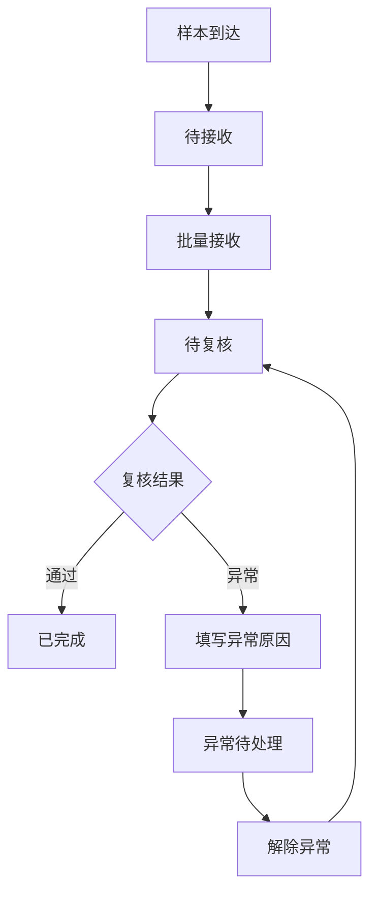
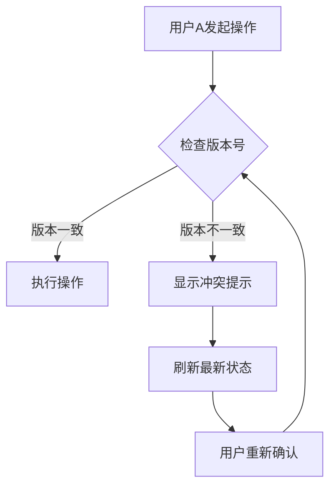

## 1. 产品概述

实验室样本交接复核系统是一个用于多人协同管理样本从采集点到检测台流转状态的Web应用。解决样本交接过程中信息不透明、责任不明确、状态冲突等问题，确保样本流转全程可追溯。

## 2. 核心功能

### 2.1 用户角色
| 角色 | 注册方式 | 核心权限 |
|------|---------|---------|
| 操作员 | 系统预置用户 | 接收样本、复核样本、标记异常、解除异常 |
| 管理员 | 系统预置用户 | 查看所有记录、管理用户、配置系统参数 |

### 2.2 功能模块
1. **样本批次看板**：按状态分组展示所有样本批次，实时更新统计数量
2. **样本详情页**：查看单个批次的样本列表，支持批量操作和逐个操作
3. **流转记录页**：查看每个样本的完整操作历史
4. **异常处理页**：集中处理异常样本，填写异常原因

### 2.3 页面详情
| 页面名称 | 模块名称 | 功能描述 |
|---------|---------|---------|
| 样本批次看板 | 待接收区域 | 展示待接收的样本批次，支持批量接收操作 |
| 样本批次看板 | 待复核区域 | 展示待复核的样本批次，点击进入详情页 |
| 样本批次看板 | 异常待处理区域 | 展示异常样本批次，点击进入异常处理 |
| 样本批次看板 | 已完成区域 | 展示已完成的样本批次，支持查看历史记录 |
| 样本详情页 | 样本列表 | 展示批次内所有样本，支持复选框选择 |
| 样本详情页 | 操作按钮组 | 批量接收、逐个复核、标记异常、解除异常 |
| 样本详情页 | 冲突提示 | 多人操作冲突时显示警告并刷新最新状态 |
| 流转记录页 | 时间轴 | 按时间顺序展示样本的所有操作记录 |
| 异常处理页 | 异常表单 | 填写异常原因，提交后进入异常待处理状态 |

## 3. 核心流程

### 3.1 样本流转流程

### 3.2 多人协作冲突处理流程

## 4. 用户界面设计

### 4.1 设计风格
- **主色调**：深蓝色(#1e3a5f)搭配青绿色(#00c9a7)，体现专业、严谨的实验室氛围
- **辅助色**：橙色(#ff6b35)用于警告，红色(#e74c3c)用于异常，绿色(#27ae60)用于完成
- **按钮风格**：圆角矩形，hover时微动画效果
- **字体**：Inter作为主字体，清晰易读
- **布局**：卡片式布局，左侧导航，右侧主内容区
- **图标**：使用Lucide图标库

### 4.2 页面设计概览
| 页面名称 | 模块名称 | UI元素 |
|---------|---------|--------|
| 样本批次看板 | 顶部统计栏 | 四个状态统计卡片，显示数量和百分比 |
| 样本批次看板 | 状态分组区域 | 四个横向区域，每个区域包含批次卡片列表 |
| 样本批次看板 | 批次卡片 | 显示批次号、样本数量、来源单位、到达时间 |
| 样本详情页 | 顶部信息栏 | 批次号、来源单位、接收时间、当前责任人 |
| 样本详情页 | 样本表格 | 采集编号、保存条件、状态、操作按钮 |
| 样本详情页 | 批量操作区 | 全选框、批量接收按钮、批量复核按钮 |

### 4.3 响应式设计
- **桌面端**：1200px以上，完整展示四个状态区域
- **平板端**：768px-1200px，两个状态区域并排
- **移动端**：768px以下，单列展示，底部导航

### 4.4 核心交互细节
- 样本状态变更时有平滑过渡动画
- 冲突检测时弹出模态框提示
- 批量操作时有进度条反馈
- 悬停时显示样本详细信息tooltip

## 5. 数据字段定义

### 5.1 样本批次字段
| 字段名 | 类型 | 说明 |
|-------|------|------|
| batchId | string | 批次唯一标识 |
| batchNo | string | 批次编号 |
| sourceUnit | string | 来源单位 |
| arrivalTime | datetime | 到达时间 |
| status | enum | 待接收/待复核/异常待处理/已完成 |
| sampleCount | number | 样本数量 |
| currentResponsible | string | 当前责任人 |
| version | number | 版本号(用于冲突检测) |

### 5.2 样本字段
| 字段名 | 类型 | 说明 |
|-------|------|------|
| sampleId | string | 样本唯一标识 |
| collectionNo | string | 采集编号 |
| batchId | string | 所属批次 |
| preservationCondition | string | 保存条件 |
| status | enum | 待接收/待复核/异常待处理/已完成 |
| currentResponsible | string | 当前责任人 |
| abnormalReason | string | 异常说明 |
| version | number | 版本号(用于冲突检测) |

### 5.3 流转记录字段
| 字段名 | 类型 | 说明 |
|-------|------|------|
| recordId | string | 记录唯一标识 |
| sampleId | string | 关联样本 |
| operator | string | 操作人 |
| action | enum | 接收/复核通过/复核异常/解除异常/退回 |
| actionTime | datetime | 操作时间 |
| remark | string | 备注说明 |
