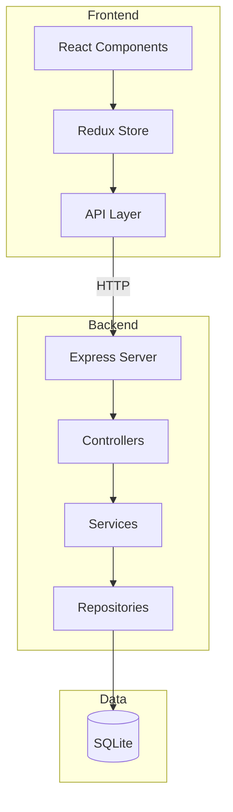
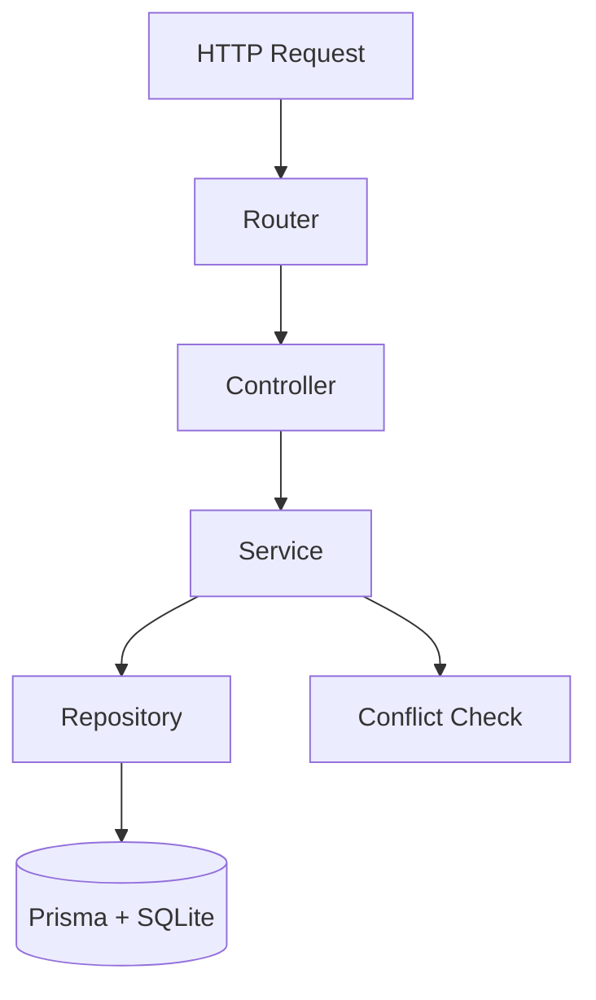
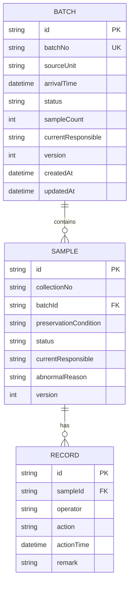

## 1. 架构设计



## 2. 技术选型

- **前端**: React@18 + TypeScript + TailwindCSS@3 + Vite
- **状态管理**: Redux Toolkit
- **路由**: React Router@6
- **图标**: Lucide React
- **后端**: Express@4 + TypeScript
- **数据库**: SQLite (文件型数据库，无需额外服务)
- **ORM**: Prisma
- **API文档**: Swagger UI

## 3. 路由定义

| 路由 | 用途 |
|------|------|
| / | 样本批次看板首页 |
| /batch/:id | 样本批次详情页 |
| /records | 流转记录查询页 |
| /abnormal | 异常样本处理页 |

## 4. API定义

### 4.1 批次相关API

#### GET /api/batches
获取所有批次列表

**请求参数**:
```typescript
interface GetBatchesQuery {
  status?: 'pending_receive' | 'pending_review' | 'abnormal' | 'completed';
}
```

**响应**:
```typescript
interface Batch {
  id: string;
  batchNo: string;
  sourceUnit: string;
  arrivalTime: string;
  status: 'pending_receive' | 'pending_review' | 'abnormal' | 'completed';
  sampleCount: number;
  currentResponsible: string;
  version: number;
  createdAt: string;
  updatedAt: string;
}
```

#### GET /api/batches/:id
获取单个批次详情

#### POST /api/batches
创建新批次

**请求体**:
```typescript
interface CreateBatchRequest {
  batchNo: string;
  sourceUnit: string;
  samples: {
    collectionNo: string;
    preservationCondition: string;
  }[];
}
```

#### PUT /api/batches/:id/receive
批量接收批次样本

**请求体**:
```typescript
interface ReceiveBatchRequest {
  version: number;
  operator: string;
}
```

### 4.2 样本相关API

#### GET /api/batches/:id/samples
获取批次内所有样本

**响应**:
```typescript
interface Sample {
  id: string;
  collectionNo: string;
  preservationCondition: string;
  status: 'pending_receive' | 'pending_review' | 'abnormal' | 'completed';
  currentResponsible: string;
  abnormalReason: string | null;
  version: number;
  batchId: string;
}
```

#### PUT /api/samples/:id/review
复核单个样本

**请求体**:
```typescript
interface ReviewSampleRequest {
  version: number;
  operator: string;
  result: 'pass' | 'abnormal';
  abnormalReason?: string; // result为abnormal时必填
}
```

#### PUT /api/samples/:id/resolve-abnormal
解除样本异常

**请求体**:
```typescript
interface ResolveAbnormalRequest {
  version: number;
  operator: string;
}
```

### 4.3 流转记录API

#### GET /api/records
获取流转记录列表

**请求参数**:
```typescript
interface GetRecordsQuery {
  sampleId?: string;
  batchId?: string;
  operator?: string;
  action?: 'receive' | 'review_pass' | 'review_abnormal' | 'resolve_abnormal' | 'reject';
  startTime?: string;
  endTime?: string;
}
```

**响应**:
```typescript
interface Record {
  id: string;
  sampleId: string;
  sampleCollectionNo: string;
  batchId: string;
  batchNo: string;
  operator: string;
  action: 'receive' | 'review_pass' | 'review_abnormal' | 'resolve_abnormal' | 'reject';
  actionTime: string;
  remark: string | null;
}
```

## 5. 服务端架构图



## 6. 数据模型

### 6.1 ER图



### 6.2 数据初始化

系统启动时自动创建以下初始数据：
- 默认用户：operator1, operator2, admin
- 示例批次和样本数据用于演示

## 7. 冲突检测机制

### 7.1 乐观锁实现
- 每个批次和样本都有version字段
- 操作时携带当前version
- 服务端比较version，不一致则返回409 Conflict
- 客户端收到409后刷新最新数据并提示用户

### 7.2 冲突响应格式
```typescript
interface ConflictResponse {
  error: 'CONFLICT';
  message: '该数据已被其他用户修改，请刷新后重新操作';
  currentVersion: number;
}
```

## 8. 项目结构

### 8.1 前端结构
```
frontend/
├── src/
│   ├── components/        # 通用组件
│   ├── pages/             # 页面组件
│   ├── store/             # Redux状态管理
│   ├── api/               # API请求层
│   ├── types/             # TypeScript类型定义
│   ├── utils/             # 工具函数
│   └── App.tsx
├── public/
├── index.html
├── package.json
├── tsconfig.json
├── vite.config.ts
└── tailwind.config.js
```

### 8.2 后端结构
```
backend/
├── src/
│   ├── controllers/       # 控制器
│   ├── services/          # 业务逻辑层
│   ├── repositories/      # 数据访问层
│   ├── routes/            # 路由定义
│   ├── middleware/        # 中间件
│   ├── types/             # TypeScript类型定义
│   ├── utils/             # 工具函数
│   ├── prisma/            # Prisma配置
│   └── index.ts
├── package.json
├── tsconfig.json
└── .env
```
